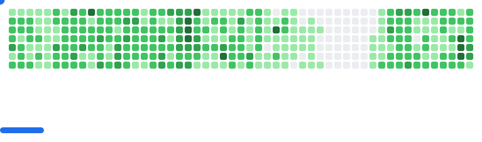

<h1 align=center style="font-variant:small-caps;">choose joy</h1><h1 align=center>LOVE OVER FEAR</h1><h2 align=center>forever &mdash; forever</h2>

  

   
<a href=https://openprocessing.org/user/15252?view=sketches>OpenProcessing</a> | <a href=https://github.com/o0101?tab=repositories&q=&type=&language=&sort=stargazers>Most starred repositories</a> | <a href=https://github.com/BrowserBox/BrowserBox>BrowserBox</a> | <a href=https://github.com/DO-SAY-GO/dn>DownloadNet</a> | <a href=https://dosaygo>DOSAYGO</a> | <a href=https://leetcode.com/dosyago/>LeetCode</a> | <a href=https://linkedin.com/in/cris-dosyago>LinkedIn</a> 
   

   
  <h1 align=center style="text-align:center;">❤️</h1>

 

<picture>
  <source
    media="(prefers-color-scheme: dark)"
    srcset="images/breakout-dark.svg"
  />
  <source
    media="(prefers-color-scheme: light)"
    srcset="images/breakout-light.svg"
  />
  
</picture>

